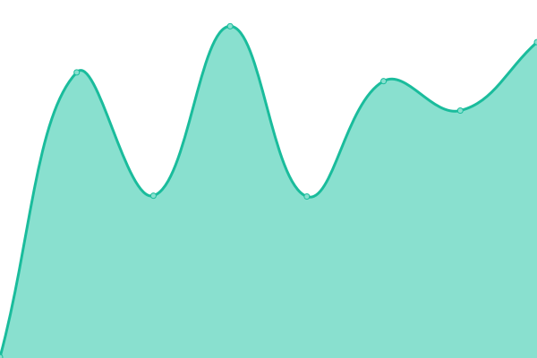

# [📈 Live Status](https://demo.upptime.js.org): <!--live status--> **Todos los sistemas están operativos**

This repository contains the open-source uptime monitor and status page for [Leonardo Gonzalez](https://demo.upptime.js.org), powered by [Upptime](https://github.com/upptime/upptime).

With [Upptime](https://upptime.js.org), you can get your own unlimited and free uptime monitor and status page, powered entirely by a GitHub repository. We use [Issues](https://github.com/gonzalezrujano/sigloxxi_status/issues) as incident reports, [Actions](https://github.com/gonzalezrujano/sigloxxi_status/actions) as uptime monitors, and [Pages](https://demo.upptime.js.org) for the status page.

<!--start: status pages-->
<!-- This summary is generated by Upptime (https://github.com/upptime/upptime) -->
<!-- Do not edit this manually, your changes will be overwritten -->
<!-- prettier-ignore -->
| URL | Status | Historial | Response Time | Funcionando desde siempre |
| --- | ------ | ------- | ------------- | ------ |
|  [Página principal](https://colegiosigloxxi.net) | Operativo | [pagina-principal.yml](https://github.com/gonzalezrujano/sigloxxi_status/commits/HEAD/history/pagina-principal.yml) | 

 304ms
     
 | 

<a href="https://gonzalezrujano.github.io/sigloxxi_status/history/pagina-principal">100.00%</a>
    

|  [Registro de alumnos nuevos](https://register.colegiosigloxxi.net) | Operativo | [registro-de-alumnos-nuevos.yml](https://github.com/gonzalezrujano/sigloxxi_status/commits/HEAD/history/registro-de-alumnos-nuevos.yml) | 

 228ms
     
 | 

<a href="https://gonzalezrujano.github.io/sigloxxi_status/history/registro-de-alumnos-nuevos">100.00%</a>
    

|  [Control de pagos](https://pagos.colegiosigloxxi.net/auth/login) | Operativo | [control-de-pagos.yml](https://github.com/gonzalezrujano/sigloxxi_status/commits/HEAD/history/control-de-pagos.yml) | 

 242ms
     
 | 

<a href="https://gonzalezrujano.github.io/sigloxxi_status/history/control-de-pagos">100.00%</a>
    

|  [Aula virtual](https://aula.colegiosigloxxi.net/auth/login) | Operativo | [aula-virtual.yml](https://github.com/gonzalezrujano/sigloxxi_status/commits/HEAD/history/aula-virtual.yml) | 

 227ms
     
 | 

<a href="https://gonzalezrujano.github.io/sigloxxi_status/history/aula-virtual">100.00%</a>
    

<!--end: status pages-->

[**Visit our status website →**](https://demo.upptime.js.org)

## 📄 License

- Powered by: [Upptime](https://github.com/upptime/upptime)
- Code: [MIT](./LICENSE) © [Anand Chowdhary](https://anandchowdhary.com), supported by [Pabio](https://pabio.com)
- Data in the `./history` directory: [Open Database License](https://opendatacommons.org/licenses/odbl/1-0/)
